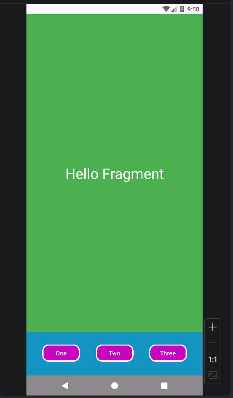
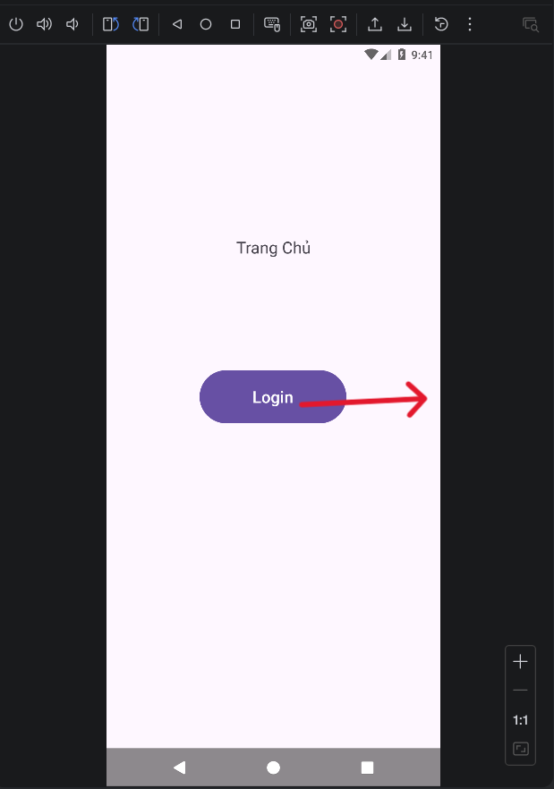
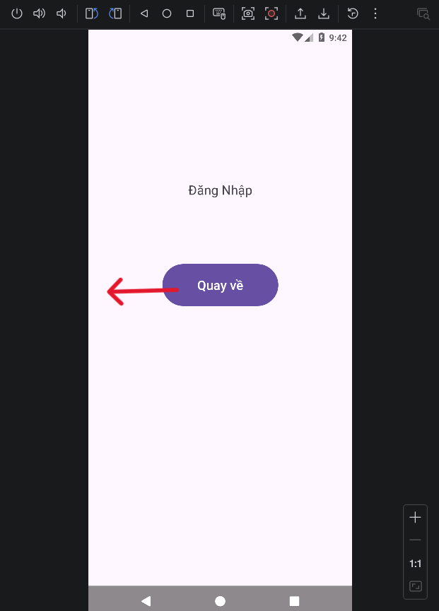
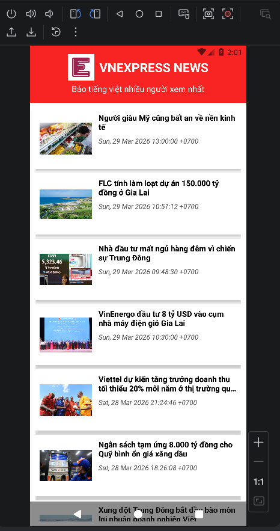

# Lập Trình Thiết Bị Di Động - **Nguyễn Đình Khánh** - [65131460]

 **Mô tả:** Đây là kho lưu trữ mã nguồn các bài tập thực hành Lập trình Android (Java) của tôi.

##  Kho lưu trữ bài tập thực hành 
### BaiTH11: Fragment Tĩnh (BaiTH11FragmentTinh)
[Chi tiết code](./BaiTH11FragmentTinh/app/src/main/) | Ảnh minh họa:
 
 *Fragment tĩnh Footer và Content dùng FragmentContainerView*

---

### BaiTH10: Sử Dụng Intent chuyển trang (BaiTH10_ChuyenTrangIntent)
[Chi tiết code](./BaiTH10_ChuyenTrangIntent/app/src/main/) | Ảnh minh họa:
<table>
  <tr>
    <td align="center"></td>
    <td align="center"></td
  </tr>
</table>
 *Chuyển trang dùng Button gắn onclick Intent*

---

### BTTH: Xây Dựng Ứng Dụng Đọc Báo Tổng Hợp
[Chi tiết code](./UD_DocBao/app/src/main/) | Ảnh minh họa:
 
 *Ứng dụng đọc báo trực tuyến từ nguồn RSS (VnExpress), kết hợp RecyclerView.*

---

### BaiTH9: Sử Dụng RecyclerView (BaiTH9_Recyclerview)
[Chi tiết code](./BaiTH9_Recyclerview/app/src/main/) | Ảnh minh họa:
<table>
  <tr>
    <td align="center"></td>
    <td align="center"></td>
    <td align="center"></td>
  </tr>
</table>
 *Hiển thị danh sách dữ liệu RecyclerView (linear, grid, horizontal).*

---

### BaiTH8: ListView Tùy Chỉnh (BaiTH8_TuyChinhLV)
[Chi tiết code](./BaiTH8_TuyChinhLV/app/src/main/) | Ảnh minh họa:
 
 *Tùy biến giao diện ListView hiển thị danh sách phức tạp hơn.*

---

### BaiTH7: Sử Dụng ListView (BaiTH7_ListView)
[Chi tiết code](./BaiTH7_ListView/app/src/main/) | Ảnh minh họa:
 
 *Hiển thị danh sách dữ liệu cơ bản bằng ListView.*

---

### BaiTH6: Xử Lý Sự Kiện Tính Tổng (BaiTH6_XuLySuKien_TinhTong)
[Chi tiết code](./BaiTH6_XuLySuKien_TinhTong/app/src/main/) | Ảnh minh họa:
 
 *Bài thực hành, tương tác với các điều khiển cơ bản, sử dụng thuộc tính onClick của Button*

---

### BaiTH5: Xử Lý Sự Kiện (BaiTH5_XuLySuKien1)
[Chi tiết code](./BaiTH5_XuLySuKien1/app/src/main/) | Ảnh minh họa:
 
 *xử lý sự kiện setOnClickListener dựa trên giao diện bài cũ.*

---

### BTTH4: Tính Tổng 2 Số (BTTH4_LinearLayout_Tong2So)
[Chi tiết code](./BTTH4_LinearLayout_Tong2So/app/src/main/) | Ảnh minh họa:
 
 *Ứng dụng nhập hai số và hiển thị kết quả tổng của chúng.*

---

### BTTH3: LinearLayout (BTTH3)
[Chi tiết code](./BTTH3/app/src/main/) | Ảnh minh họa:
 
 *Thực hành thiết kế giao diện sử dụng LinearLayout.*

---

### BTTH2: Thiết kế Giao diện (BTTH2_1GiaoDien)
[Chi tiết code](./BTTH2_1GiaoDien/app/src/main/) | Ảnh minh họa:
 
 *Bài thực hành, tương tác với các điều khiển cơ bản, sử dụng thuộc tính onClick của Button*

---

### HelloWorld
[Chi tiết code](./HelloWorld/app/src/main/) | Ảnh minh họa:
 
 *"Hello World!".*

---