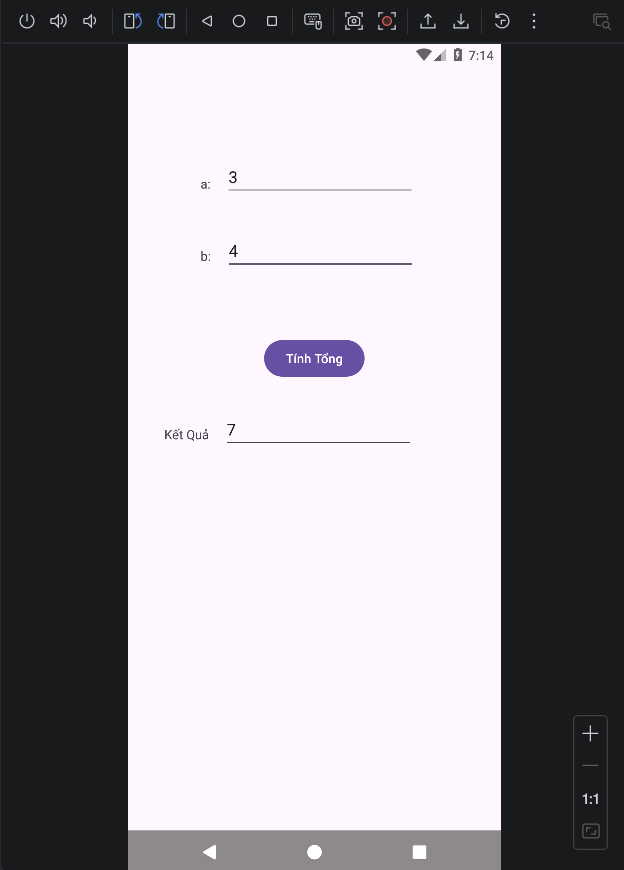
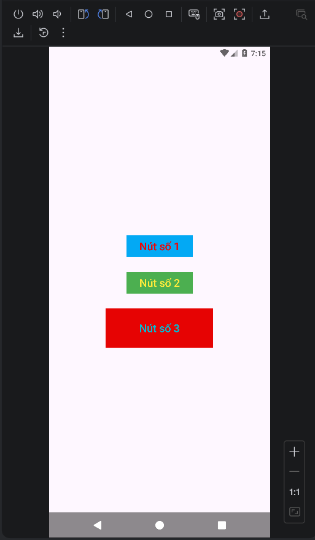
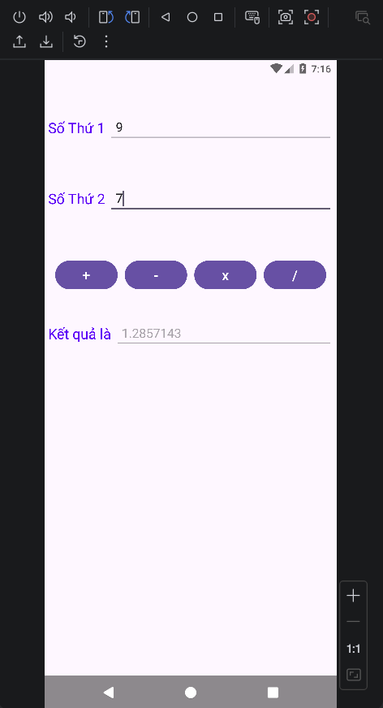
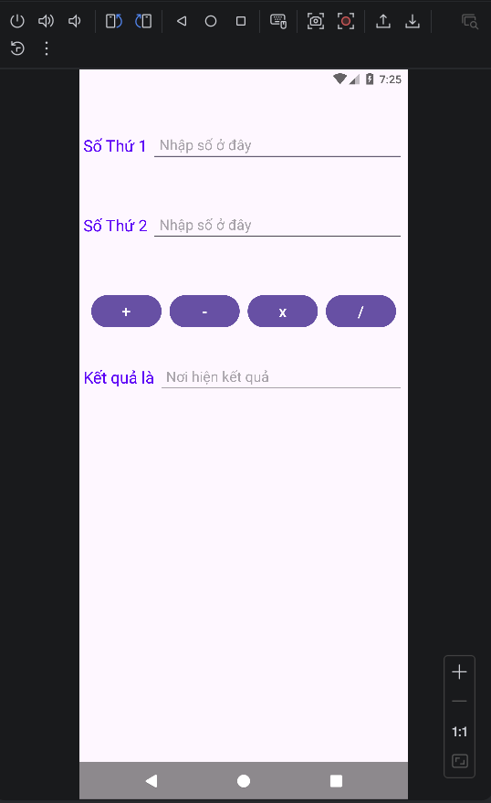
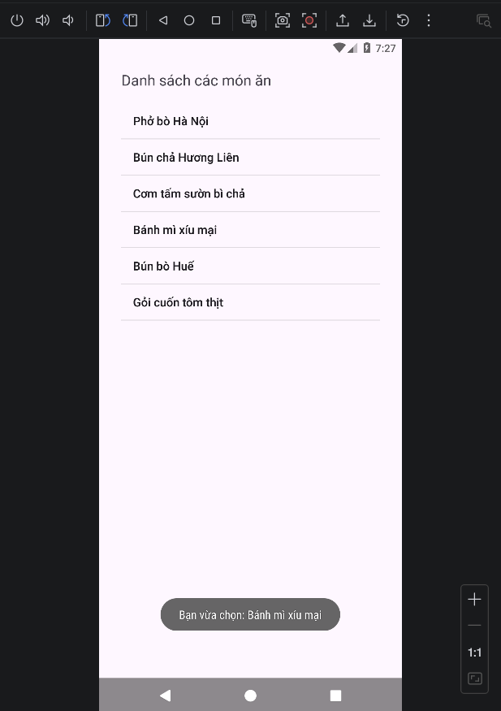
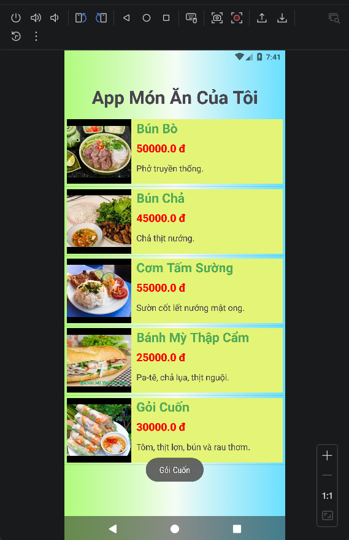
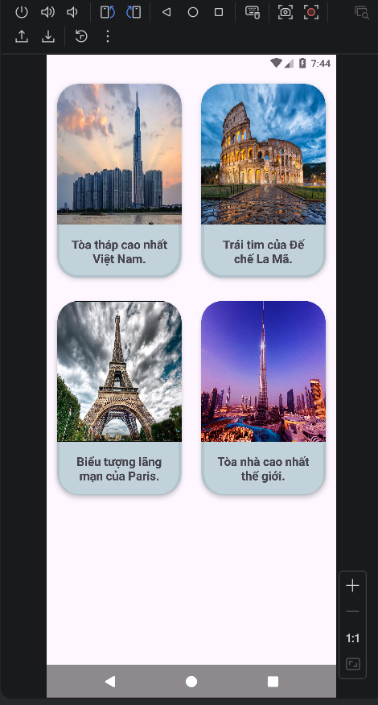
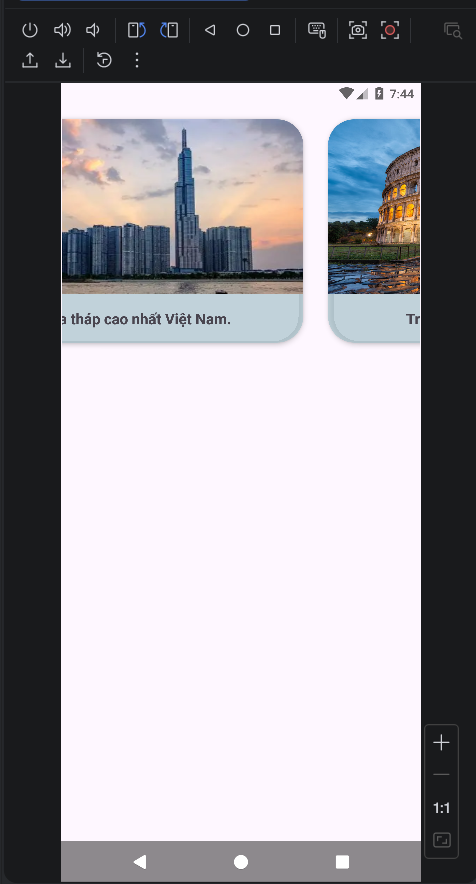

# Lập Trình Thiết Bị Di Động - **Nguyễn Đình Khánh** - [65131460]

 **Mô tả:** Đây là kho lưu trữ mã nguồn các bài tập thực hành Lập trình Android (Java) của tôi.

##  Kho lưu trữ bài tập thực hành 

### HelloWorld
[Chi tiết code](./HelloWorld) | Ảnh minh họa:
 
 *"Hello World!".*

---

### BTTH2: Thiết kế Giao diện (BTTH2_1GiaoDien)
[Chi tiết code](./BTTH2_1GiaoDien) | Ảnh minh họa:
 
 *Bài thực hành, tương tác với các điều khiển cơ bản, sử dụng thuộc tính onClick của Button*

---

### BTTH3: LinearLayout (BTTH3)
[Chi tiết code](./BTTH3) | Ảnh minh họa:
 
 *Thực hành thiết kế giao diện sử dụng LinearLayout.*

---

### BTTH4: Tính Tổng 2 Số (BTTH4_LinearLayout_Tong2So)
[Chi tiết code](./BTTH4_LinearLayout_Tong2So) | Ảnh minh họa:
 
 *Ứng dụng nhập hai số và hiển thị kết quả tổng của chúng.*

---

### BaiTH5: Xử Lý Sự Kiện (BaiTH5_XuLySuKien1)
[Chi tiết code](./BaiTH5_XuLySuKien1) | Ảnh minh họa:
 
 *xử lý sự kiện setOnClickListener dựa trên giao diện bài cũ.*

---

### BaiTH6: Xử Lý Sự Kiện Tính Tổng (BaiTH6_XuLySuKien_TinhTong)
[Chi tiết code](./BaiTH6_XuLySuKien_TinhTong) | Ảnh minh họa:
 
 *Bài thực hành, tương tác với các điều khiển cơ bản, sử dụng thuộc tính onClick của Button*

---

### BaiTH7: Sử Dụng ListView (BaiTH7_ListView)
[Chi tiết code](./BaiTH7_ListView) | Ảnh minh họa:
 
 *Hiển thị danh sách dữ liệu cơ bản bằng ListView.*

---

### BaiTH8: ListView Tùy Chỉnh (BaiTH8_TuyChinhLV)
[Chi tiết code](./BaiTH8_TuyChinhLV) | Ảnh minh họa:
 
 *Tùy biến giao diện ListView hiển thị danh sách phức tạp hơn.*

---

### BaiTH9: Sử Dụng RecyclerView (BaiTH9_Recyclerview)
[Chi tiết code](./BaiTH9_Recyclerview) | Ảnh minh họa:
<table>
  <tr>
    <td align="center"></td>
    <td align="center"></td>
    <td align="center"></td>
  </tr>
</table>
 *Hiển thị danh sách dữ liệu RecyclerView (linear, grid, horizontal).*

---
